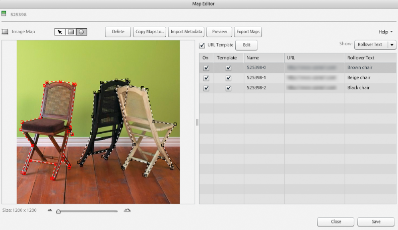

# Création de zones cliquables {#creating-image-maps}

Une zone cliquable est une zone d’une image, d’une page de catalogue électronique ou d’une image dans une visionneuse à 360° qui affiche un panneau de survol avec du texte. Lorsque l’utilisateur sélectionne une zone cliquable, une action quelconque est déclenchée. Par exemple, une page web est lancée afin que l’utilisateur ou l’utilisatrice puisse en savoir plus sur un produit. Un contour apparaît autour d’une zone cliquable lorsque l’utilisateur place le pointeur dessus.

Outre la possibilité de créer des zones cliquables dans Adobe Dynamic Media Classic, vous pouvez également le faire lorsque vous concevez un catalogue dans Adobe Acrobat ou Adobe InDesign.

Lorsque vous créez des zones cliquables, vous pouvez effectuer l’une des opérations suivantes :

* Saisir un texte de survol.
* Saisissez le JavaScript et les URL de lancement des pages web.
* Créer des modèles d’URL pour les zones cliquables.
* Copiez des zones cliquables dans d’autres images, pages de catalogue électronique ou visionneuses à 360°.
* Exporter des zones cliquables au format CSV ou XML.
* Importez des métadonnées d’image à partir d’un fichier délimité par des tabulations ou d’un fichier XML.
* Définir d’autres actions conformément aux directives du consortium WWW (World Wide Web).
* Prévisualiser des zones cliquables.

## Dessiner et ajuster une zone cliquable {#drawing-and-adjusting-an-image-map}

1. Effectuez l’une des opérations suivantes :

   * Si vous utilisez une image dans la vue Grille ou Liste, sélectionnez **[!UICONTROL Zone cliquable]** dans la liste déroulante Modifier. Vous pouvez également l’ouvrir dans l’affichage des détails, puis sélectionner **[!UICONTROL Zone cliquable]** au-dessus de l’image.
   * Si vous utilisez une visionneuse à 360° dans la vue Grille ou Liste, sélectionnez **[!UICONTROL Modifier]**. Ou ouvrez-le dans Affichage des détails, puis sélectionnez **[!UICONTROL Modifier]**. Sélectionnez une ressource image, puis sélectionnez **[!UICONTROL Zone cliquable]**.
   * Si vous utilisez un catalogue électronique dans la vue Grille, Liste ou Détail, sélectionnez **[!UICONTROL Modifier]**. Sélectionnez l’onglet **[!UICONTROL Mapper des pages]**.

   

1. Tracez une zone cliquable rectangulaire ou polygonale (avec de nombreux côtés) :

   * **Zone rectangulaire** : sélectionnez l’outil Rectangle Image Map et faites glisser le pointeur sur la page pour créer le rectangle. Pour ajouter un point à une texture rectangulaire (et donc le transformer en texture polygonale), appuyez sur Ctrl, puis placez l&#39;outil d&#39;insertion à l&#39;emplacement souhaité et sélectionnez.

   * **Zone polygonale** : sélectionnez l’outil Zone cliquable polygonale et sélectionnez des points sur le périmètre de la zone de l’image à entourer. A l’aide du curseur de densité du polygone, modulez la densité du point. La densité initiale est conservée si vous sélectionnez d’autres zones. Si un point est ajouté, supprimé ou déplacé dans le polygone, la densité d&#39;origine est perdue. Le curseur est réinitialisé à sa valeur maximale.

1. Nommez la zone cliquable, si vous le souhaitez, dans la liste Zone cliquable. Après avoir dessiné une zone cliquable, Adobe Dynamic Media Classic lui attribue un nom.

   Pour créer le nom, Adobe Dynamic Media Classic ajoute un numéro séquentiel au nom de l’image ou de la page de catalogue électronique que vous utilisez. Vous pouvez indiquer le nom de votre choix.

1. Si vous souhaitez que les utilisateurs ouvrent une nouvelle page web lorsqu’ils sélectionnent la zone cliquable, saisissez l’URL dans la liste Zone cliquable.

   Voir [pour saisir le JavaScript et les URL](creating-image-maps.md#using_a_template_to_enter_javascript_and_urls).

1. Pour qu’un texte de survol s’affiche lorsque les utilisateurs déplacent le pointeur sur la zone cliquable, saisissez le texte dans la liste Zone cliquable. Dans la liste Zone cliquable, sélectionnez le menu **[!UICONTROL Afficher]** et sélectionnez **[!UICONTROL Texte de survol]**. Saisissez ensuite le texte que vous souhaitez que les utilisateurs voient à l’écran. Vous pouvez rédiger le texte dans une application de traitement de texte et le copier dans le champ Texte de survol.

1. Si vous souhaitez qu’une autre action se déclenche lorsque les utilisateurs déplacent la souris sur une zone cliquable, définissez l’action. Dans la liste déroulante **[!UICONTROL Afficher]**, sélectionnez **[!UICONTROL Autres actions]**. Spécifiez les attributs de l’action. (Accédez à **[!UICONTROL Afficher]** > **[!UICONTROL Les deux]** pour créer un texte de survol et une action pour une zone cliquable.)

   Voir [Définition d’autres actions pour les zones cliquables](creating-image-maps.md#defining_other_actions_for_image_maps).

1. (Facultatif) Utilisez l’une des méthodes suivantes :

   * Pour prévisualiser des zones cliquables, sélectionnez **[!UICONTROL Aperçu]**.
   * Pour supprimer une zone cliquable ou un sommet de polygone, sélectionnez une forme sur l&#39;image, puis sélectionnez **[!UICONTROL Supprimer]**. Ou, pour un catalogue électronique, dans l’onglet Commander des pages, sélectionnez **[!UICONTROL Effacer les zones cliquables]** pour supprimer les zones cliquables de toutes les pages.
   * Pour supprimer l’un des éléments suivants :
     * Zone cliquable à partir d’une image
     * image dans une visionneuse à 360°
     * ou une page de catalogue électronique

     temporairement, sans le supprimer, désélectionnez l’option Activé appropriée dans la liste Zone cliquable .

1. Sélectionnez **[!UICONTROL Enregistrer]**.

### Ajuster la position, la forme et la taille des zones cliquables {#adjusting-the-position-shape-and-size-of-image-maps}

Pour modifier la position, la forme et la taille d’une zone cliquable, sélectionnez le bouton Zone cliquable . Sélectionnez ensuite l’outil **[!UICONTROL Panoramique]** et suivez les instructions suivantes :

* **Modifier la position** : déplacez le pointeur près de la bordure de la zone cliquable, mais pas au-dessus. Lorsque l’icône de déplacement s’affiche, faites glisser la carte vers un nouvel emplacement.

* **Modifier la taille et la forme** : la manière de modifier la forme et la taille d’une zone cliquable dépend de l’utilisation d’une zone cliquable rectangulaire ou polygonale :

>[!TIP]
>
>Pour modifier la vue et afficher plus clairement votre zone cliquable, faites glisser le curseur Taille en bas de l’écran.

* **Zone cliquable rectangulaire** : placez le pointeur sur un côté ou un coin de la zone cliquable. Lorsque le pointeur prend la forme d’une flèche à double pointe, faites glisser la souris. Pour modifier la taille tout en conservant les proportions (la forme), maintenez la touche Maj enfoncée tout en faisant glisser.

* **Zone cliquable polygonale** : faites glisser une poignée de sélection carrée. Pour créer une poignée de sélection, sélectionnez la bordure de la zone cliquable et commencez à la faire glisser.

### Gérer les zones cliquables se chevauchant {#handling-overlapping-image-maps}

Si votre page d’image ou de catalogue électronique comprend plusieurs zones cliquables et que celles-ci se chevauchent, vous pouvez déterminer la manière dont elles se chevauchent. Pour ce faire, changez l’ordre des zones dans la liste Zone cliquable en faisant glisser leur nom vers le haut ou vers le bas. Une position élevée dans la liste indique que la zone cliquable associée se superpose avec d’autres zones cliquables.

### Importation des données de zone cliquable {#importing-image-map-data}

Plutôt que d’entrer des données de zone cliquable sur chaque page, vous pouvez importer les données de votre image, de votre visionneuse à 360° ou de votre catalogue électronique dans l’écran Résumé de la carte. Vous importez les données de zone cliquable sous la forme d’un fichier délimité par des tabulations ou d’un fichier DTD XML. Les champs de votre fichier doivent suivre l’ordre indiqué dans l’écran Résumé du mappage : nom, libellés de table des matières, mappages, URL, texte de survol, autres actions et chaînes de recherche. L’importation de données de zone cliquable évite la saisie des données dans la liste Zone cliquable lors de la création de chaque zone cliquable.

**Pour importer des données de zone cliquable, procédez comme suit**

1. Aller à la page d’édition des zones cliquables (pour des images ou des images dans des visionneuses à 360°) ou l’onglet Pages de zones de l’écran d’édition du catalogue électronique.
1. Sélectionnez **[!UICONTROL Importer des métadonnées]**.
1. Dans la boîte de dialogue Charger les métadonnées , sélectionnez Image ou Zone cliquable pour charger les métadonnées à partir du type de propriété de ressource souhaité.
1. Dans la liste déroulante `Generate File` , sélectionnez le type de fichier que vous souhaitez créer.
1. (Facultatif) Sélectionnez **[!UICONTROL Générer]**. Cette option prévisualise les données obtenues en fonction du type de fichier que vous souhaitez créer. Sélectionnez **[!UICONTROL Fermer]** pour revenir à la boîte de dialogue Charger les métadonnées.
1. Naviguez jusqu’au fichier que vous souhaitez télécharger. Dans le champ de texte Nom de fichier, spécifiez le nom du fichier généré.
1. (Facultatif) Dans le champ Nom de la tâche, spécifiez un nom pour la tâche de téléchargement des métadonnées.
1. Sélectionnez **[!UICONTROL Charger]**.

### Copier les zones cliquables {#copying-image-maps}

Vous pouvez copier des zones cliquables d’une image (ou d’une page de catalogue électronique) à l’autre. Utilisez **[!UICONTROL Copier la zone cliquable]** pour simplifier le processus de création. Pour créer des zones cliquables dans des images ou des pages qui partagent une disposition ou une structure de mappage, vous pouvez également les copier.

Par exemple, la copie de zones cliquables dans un catalogue électronique est très pratique pour copier toutes les zones cliquables entre différentes versions linguistiques d’un même catalogue électronique. Pour de meilleurs résultats, la copie est plus efficace si vous copiez entre des catalogues électroniques avec le même nombre de pages et les mêmes images. Si le catalogue électronique dans lequel vous copiez contient déjà des zones cliquables, celles-ci sont supprimées lors de la copie.

**Pour copier des zones cliquables :**

1. Aller à la page d’édition des zones cliquables (pour des images ou des images dans des visionneuses à 360°) ou l’onglet Pages de zones de l’écran d’édition du catalogue électronique.
1. Sélectionnez **[!UICONTROL Copier les mappages dans]**.
1. Effectuez l’une des opérations suivantes, selon que vous copiez des zones cliquables à partir d’images ou à partir d’un catalogue électronique :

   * (Images) Dans l’écran Sélectionner des images, sélectionnez les images dans lesquelles vous souhaitez copier les zones cliquables.
   * (Catalogue électronique) Dans l’écran Sélectionner un fichier, sélectionnez les images ou les pages de catalogue électronique dans lesquelles vous souhaitez copier les zones cliquables.

1. Choisissez **[!UICONTROL Sélectionner]**.

## Utiliser un modèle pour saisir le JavaScript et les URL {#using-a-template-to-enter-javascript-and-urls}

Pour simplifier la saisie des URL de zone cliquable, vous pouvez définir un modèle d’URL (également appelé modèle Href). Définissez un modèle d’URL si la plupart des URL des zones cliquables partagent un format commun et fixe. Si vous définissez la partie de l’URL fixe comme modèle d’URL, vous êtes dispensé de l’entrer chaque fois que vous créez une zone cliquable. Votre modèle d’URL peut également contenir des commandes JavaScript, des noms de chemin et des paramètres. Par défaut, le modèle d’URL contient un gestionnaire JavaScript Adobe Dynamic Media Classic propriétaire appelé `loadProduct` qui ouvre l’image dans une nouvelle fenêtre.

>[!NOTE]
>
>Lorsque vous ajoutez le code JavaScript dans l’attribut HREF de votre zone cliquable, le code est traité sur l’ordinateur de l’utilisateur. Par conséquent, assurez-vous que le code JavaScript est sécurisé.

### A propos des modèles d’URL {#about-url-templates}

Le modèle d’URL fonctionne en remplaçant le contenu de la colonne URL dans la liste Zone cliquable . Il les remplace par les signes dollar double ($$) dans le modèle :

```as3
Javascript:loadProduct('$$');void(0);
```

Vous placez toutes les valeurs qui ne changent pas entre les zones cliquables dans le modèle d’URL. Ajoutez uniquement les valeurs qui changent dans la colonne URL de la liste Zone cliquable. Par exemple :

* Modèle d’URL : `javascript:loadProduct('https://www.examplesitehere.com/$$');void(0);`
* Valeur de l’URL : `product.htm`
* URL réelle générée : `javascript:loadProduct('https://www.examplesitehere.com/product.html);void(0);`

Par défaut, le modèle d’URL comprend un gestionnaire JavaScript Adobe Dynamic Media Classic propriétaire appelé `loadProduct` qui ouvre une nouvelle fenêtre avec la destination de l’URL. Cependant, vous pouvez utiliser n’importe quel code JavaScript pour remplacer ce gestionnaire JavaScript ou utiliser l’un des gestionnaires Adobe Dynamic Media Classic suivants :

* `loadProductCW` : affiche la cible URL spécifiée dans la colonne URL de la fenêtre active. Ce code est réservé principalement aux catalogues électroniques intégrés dans une page d’un site Web.

* `loadProductPW` : affiche la cible URL spécifiée dans la colonne URL de la fenêtre parente (la page qui a ouvert la page active). La fenêtre active reste ouverte, mais la fenêtre parent change pour afficher l’URL cible.

  >[!NOTE]
  >
  >Le gestionnaire `loadProductPW` ne prend pas en charge les visionneuses DHTML et HTML5.

### Création d’un modèle d’URL {#creating-a-url-template}

1. Dans l’écran Éditeur de cartes (images ou visionneuses à 360°) ou dans l’onglet Mapper les pages de l’écran Catalogue électronique (catalogues électroniques), sélectionnez Modifier en regard de l’option Modèle d’URL . La boîte de dialogue Modifier le modèle de zone apparaît.
1. Saisissez le code JavaScript et l’URL complète (avec la partie variable remplacée par des signes dollar [$$]). Vous pouvez coller le code en cliquant avec le bouton droit et en choisissant **[!UICONTROL Coller]**.
1. Sélectionnez **[!UICONTROL Enregistrer]**.

### Gérer les modèles d’URL {#handling-url-templates}

La page Editeur de zone cliquable (images et visionneuses à 360°) et l’onglet Pages de zones de l’écran Catalogue électronique (catalogues électroniques) contiennent les commandes de gestion des modèles d’URL suivantes :

* **Option de modèle d’URL** : sélectionnez l’option de modèle d’URL pour appliquer votre modèle d’URL à toutes les zones cliquables d’une page image ou de catalogue électronique.

* **Option Modèle** : désélectionnez une option Modèle dans la liste Zone cliquable si vous ne souhaitez pas qu’une zone cliquable utilise le modèle d’URL.

## Définition d’autres actions pour les zones cliquables {#defining-other-actions-for-image-maps}

Vous pouvez sélectionner le menu **[!UICONTROL Afficher]** et choisir **[!UICONTROL Autres actions]** pour déclencher des actions autres que le texte de survol et les lancements de pages web. Lorsque l’utilisateur amène le pointeur sur une zone cliquable, vous pouvez initier une action. Ces actions sont des attributs définis pour les zones cliquables côté client conformément aux spécifications HTML du consortium WWW (World Wide Web). Elles comptent notamment :

* **`accesskey`** : déclenche une action lorsque l’utilisateur appuie sur une touche désignée du clavier.

* **`onfocus`** : déclenche un événement lorsque la zone cliquable reçoit la sélection à l’aide du curseur, en appuyant sur une touche de tabulation ou d’une touche d’accès. Par exemple, vous pouvez lancer une page Web lorsque la zone cliquable reçoit la sélection et la fermer lorsque la zone cliquable perd la sélection.

* **`onblur`** : déclenche un événement lorsque la zone cliquable perd le focus via le curseur ou la tabulation.

**Pour définir d’autres actions pour les zones cliquables :**

1. Dans l’écran Éditeur de cartes (images et visionneuses à 360°) ou dans l’onglet Mapper les pages de l’écran Catalogue électronique (catalogues électroniques), sélectionnez le menu **[!UICONTROL Afficher]** et sélectionnez **[!UICONTROL Autres actions]**.
1. Selon la syntaxe conforme aux spécifications HTML du consortium WWW (World Wide Web), ajoutez les attributs pris en charge dans la colonne Autres actions de la liste Zone cliquable.
1. Sélectionnez **[!UICONTROL Enregistrer]**.

Sélectionnez le menu **[!UICONTROL Afficher]** et sélectionnez **[!UICONTROL Les deux]** si vous souhaitez qu’une zone cliquable contienne un texte de survol et une action.

## Création de zones cliquables dans Adobe Acrobat ou Adobe InDesign {#creating-image-maps-in-adobe-acrobat-or-adobe-indesign}

Vous pouvez créer des zones cliquables lors de la conception de votre catalogue électronique dans Adobe Acrobat ou Adobe InDesign.

Dans Adobe Acrobat ou Adobe InDesign, créez des références de liens hypertexte à l’endroit où vous souhaitez que les zones cliquables apparaissent, puis spécifiez les emplacements URL de la zone cliquable. La sélection de l’option Extraire les liens lors du chargement du fichier PDF dans Adobe Dynamic Media Classic convertit automatiquement les liens en zones cliquables.

Pour plus d’informations, voir Aide d’Adobe InDesign ou Aide d’Adobe Acrobat.

### Création de zones cliquables dans Adobe InDesign {#to-create-image-maps-in-adobe-indesign}

1. Dans Adobe InDesign, accédez à **[!UICONTROL Fenêtre]** > **[!UICONTROL Interactive]** > **[!UICONTROL Hyperliens]**.
1. Dans le panneau Hyperliens, sélectionnez le texte, le cadre ou le graphique à transformer en zone cliquable.
1. Sélectionnez **[!UICONTROL Nouveau lien hypertexte]** dans le menu du panneau.
1. Dans la boîte de dialogue Nouveau lien hypertexte, dans le menu **[!UICONTROL Lier à]**, choisissez le **[!UICONTROL URL]**.
1. Saisissez ou collez l’ID de produit dans la zone URL.
1. Sélectionnez **[!UICONTROL OK]**. (Adobe Dynamic Media Classic complète l’URL à l’aide du modèle URL de la zone cliquable .)

   >[!NOTE]
   >
   >Il n’est pas nécessaire de définir les options d’aspect dans Adobe InDesign. Vous pouvez définir l’apparence dans Adobe Dynamic Media Classic.

1. Répétez les étapes 2 à 6 pour toutes les zones cliquables à créer.
1. Exportez les fichiers au format PDF.
1. Chargez le PDF vers Adobe Dynamic Media Classic.
1. Dans **[!UICONTROL Options]**, sélectionnez **[!UICONTROL Extraire les liens]**.

### Création de zones cliquables dans Adobe Acrobat {#to-create-image-maps-in-adobe-acrobat}

1. Dans Adobe Acrobat, accédez à **[!UICONTROL Outils]** > **[!UICONTROL Modification avancée]** > **[!UICONTROL Outil de lien]**.
1. Faites glisser la souris pour créer la zone cliquable.
1. Dans la zone Créer un lien, sélectionnez **[!UICONTROL Lien personnalisé]**, puis **[!UICONTROL Suivant]**.

>[!NOTE]
>
>Il n’est pas nécessaire de définir les options d’aspect dans Adobe Acrobat. Vous pouvez définir l’apparence dans Adobe Dynamic Media Classic.

1. Dans la zone Propriétés du lien, sélectionnez **[!UICONTROL Actions]**.
1. Sélectionnez **[!UICONTROL Ouvrir un lien web]** dans le menu Sélectionner une action, puis sélectionnez **[!UICONTROL Ajouter]**.
1. Saisissez l’ID de produit pour la zone Zone cliquable dans la zone Modifier l’URL, puis sélectionnez **[!UICONTROL OK]**. (Adobe Dynamic Media Classic complète l’URL à l’aide du modèle URL de la zone cliquable .)
1. Répétez les étapes 1 à 7 pour toutes les zones cliquables que vous souhaitez créer.
1. Enregistrez le fichier.
1. Chargez le PDF dans Adobe Dynamic Media Classic et sélectionnez Extraire les liens dans les options de PDF.
